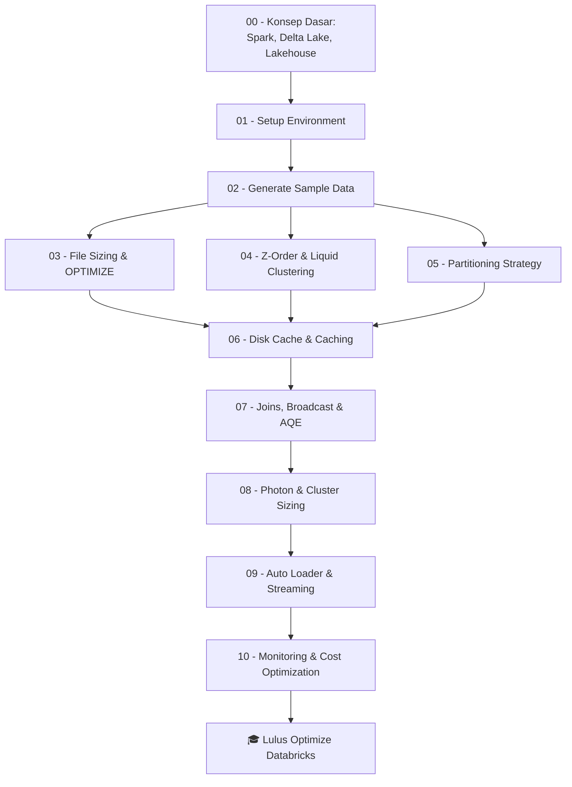

# 🚀 Belajar Optimize Azure Databricks — Tutorial Series Lengkap

Selamat datang! Series tutorial ini akan membimbing kamu **langkah demi langkah** untuk meng-_optimize_ workload di **Azure Databricks** — mulai dari setup environment, men-generate sample data, sampai teknik-teknik optimasi tingkat lanjut seperti **Liquid Clustering**, **Photon**, **AQE**, dan **Auto Loader**.

Semua materi dirangkum dari dokumentasi resmi **Microsoft Learn** dan **Databricks**.

> ⚠️ **Penting:** Repo ini untuk tujuan **edukasi pribadi**, tidak berafiliasi dengan Microsoft / Databricks, dan tidak mengandung data sensitif. Baca selengkapnya di [DISCLAIMER.md](DISCLAIMER.md).

---

## 🎯 Target Pembaca

- Data Engineer / Analyst yang baru atau sudah memakai Azure Databricks.
- Ingin memahami **kenapa** sebuah workload lambat & **bagaimana** memperbaikinya.
- Punya akses (atau ingin trial) ke Azure Databricks Workspace.

---

## 🗺️ Peta Tutorial



---

## 🏷️ Legend Ketersediaan Fitur

Setiap tutorial diberi tanda untuk membedakan fitur **open-source** vs **eksklusif Databricks**, supaya kamu tahu mana yang portable ke environment lain (mis. Spark on Kubernetes, EMR, **Microsoft Fabric** Spark) dan mana yang hanya jalan di Databricks.

> 💡 **Catatan penting:** Karena Databricks dibangun di atas Apache Spark + Delta Lake, **semua fitur 🟢 OSS dan 🟡 OSS+Enhanced otomatis juga tersedia di Databricks**. Yang membedakan hanyalah _portabilitas_-nya ke platform non-Databricks.

| Badge | Jalan di Databricks? | Jalan di Spark/Delta OSS (OSS Spark, Microsoft Fabric, Synape Analytics, etc)? | Keterangan |
|---|:---:|:---:|---|
| 🟢 **OSS** | ✅ Ya | ✅ Ya | Fitur murni open-source. Sumber: [spark.apache.org](https://spark.apache.org/docs/latest/) & [docs.delta.io](https://docs.delta.io/latest/). |
| 🟡 **OSS + Databricks-enhanced** | ✅ Ya (versi lebih optimal) | ✅ Ya (versi standar) | Ada di OSS, tapi Databricks menambah optimasi, default berbeda, atau integrasi tambahan. |
| 🔵 **Databricks-only** | ✅ Ya | ❌ Tidak | Eksklusif platform Databricks (Photon, Disk Cache, Auto Loader, Unity Catalog, dsb.). |

---

## 📚 Daftar Tutorial

| # | Tutorial | Topik Utama | Status Fitur | File |
|---|----------|------------|--------------|------|
| 00 | Konsep Dasar | Spark, Delta Lake, Delta Table, Lakehouse, Unity Catalog | 🟢 + 🔵 | [tutorials/00-konsep-dasar.md](tutorials/00-konsep-dasar.md) |
| 01 | Setup Environment | Workspace, cluster, Unity Catalog | 🔵 | [tutorials/01-setup-environment.md](tutorials/01-setup-environment.md) |
| 02 | Sample Data Generation | TPC-H mini, sales, IoT events | 🟢 | [tutorials/02-sample-data.md](tutorials/02-sample-data.md) |
| 03 | File Sizing & `OPTIMIZE` | Small file problem, compaction, auto-optimize | 🟢 (OSS Delta 1.2+/3.1+) | [tutorials/03-file-sizing-optimize.md](tutorials/03-file-sizing-optimize.md) |
| 04 | Z-Order & Liquid Clustering | Data skipping, clustering keys | 🟢 (Delta 2.0+/3.1+) + 🔵 (CLUSTER BY AUTO) | [tutorials/04-zorder-liquid-clustering.md](tutorials/04-zorder-liquid-clustering.md) |
| 05 | Partitioning Strategy | Kapan partition, kapan tidak | 🟢 | [tutorials/05-partitioning.md](tutorials/05-partitioning.md) |
| 06 | Caching & Disk Cache | Disk cache vs Spark cache, Query result cache | 🟡 Spark cache OSS, 🔵 Disk Cache | [tutorials/06-caching.md](tutorials/06-caching.md) |
| 07 | Joins, Broadcast & AQE | Adaptive Query Execution, skew | 🟢 (Spark 3.0+/3.2+) | [tutorials/07-joins-aqe.md](tutorials/07-joins-aqe.md) |
| 08 | Photon & Cluster Sizing | Photon engine, instance type, autoscaling | 🔵 | [tutorials/08-photon-cluster.md](tutorials/08-photon-cluster.md) |
| 09 | Auto Loader & Streaming | `cloudFiles`, schema evolution | 🔵 | [tutorials/09-auto-loader.md](tutorials/09-auto-loader.md) |
| 10 | Monitoring & Cost Optimization | Query Profile, system tables, predictive optimization | 🔵 | [tutorials/10-monitoring-cost.md](tutorials/10-monitoring-cost.md) |

---

## 🧩 Struktur Repository

```
Belajar_Optimize_Databricks/
├── README.md                       ← (file ini)
├── tutorials/                      ← 11 tutorial markdown
│   ├── 00-konsep-dasar.md
│   ├── 01-setup-environment.md
│   ├── 02-sample-data.md
│   ├── ...
│   └── 10-monitoring-cost.md
├── scripts/                        ← Script Python / SQL siap import ke notebook
│   ├── 00_config.py
│   ├── 01_setup_catalog.sql
│   ├── 02_generate_sample_data.py
│   ├── 03_optimize_compaction.sql
│   ├── 04_liquid_clustering.sql
│   ├── 05_partitioning_demo.py
│   ├── 06_caching_demo.py
│   ├── 07_joins_aqe_demo.py
│   ├── 08_photon_benchmark.py
│   ├── 09_auto_loader_demo.py
│   └── 10_monitoring_queries.sql
└── sample_data/                    ← Skema/contoh kecil untuk dipelajari lokal
    └── README.md
```

---

## ⚙️ Prasyarat

1. **Azure Subscription** — bisa pakai [Azure Free Account](https://azure.microsoft.com/free/) atau Databricks 14-day Free Trial.
2. **Azure Databricks Workspace** — Premium tier (untuk Unity Catalog & Photon).
3. **Cluster / SQL Warehouse**:
   - Recommended: **Databricks Runtime 15.4 LTS** atau lebih baru (untuk Liquid Clustering otomatis).
   - **Photon enabled**.
   - Worker SSD (mis. `Standard_DS3_v2` atau `Standard_E8ds_v5`) — untuk disk cache.
4. **Unity Catalog** aktif (sangat dianjurkan; mengaktifkan Predictive Optimization).
5. **Visual Studio Code** + extension **Databricks** (opsional, untuk edit & sync notebook).

> 💡 Jika kamu hanya ingin baca tanpa men-deploy: tetap bisa! Setiap tutorial menjelaskan **konsep + kode + alasan**.

---

## 🏃 Cara Menjalankan

1. Clone / download folder ini.
2. Buka [tutorials/01-setup-environment.md](tutorials/01-setup-environment.md) → ikuti langkah membuat workspace + cluster.
3. Import folder `scripts/` ke Databricks (Workspace → Import → Folder), atau gunakan **Databricks CLI** / VS Code Extension.
4. Jalankan tutorial **berurutan** (01 → 10). Tutorial 02 wajib dijalankan duluan karena membuat sample data yang dipakai tutorial berikutnya.

---

## 📖 Sumber Resmi yang Dirujuk

- [Azure Databricks — Best practices for performance efficiency](https://learn.microsoft.com/en-us/azure/databricks/lakehouse-architecture/performance-efficiency/best-practices)
- [Delta Lake best practices](https://learn.microsoft.com/en-us/azure/databricks/delta/best-practices)
- [Liquid Clustering](https://learn.microsoft.com/en-us/azure/databricks/delta/clustering)
- [Disk Cache](https://learn.microsoft.com/en-us/azure/databricks/optimizations/disk-cache)
- [Adaptive Query Execution](https://learn.microsoft.com/en-us/azure/databricks/optimizations/aqe)
- [Photon](https://learn.microsoft.com/en-us/azure/databricks/compute/photon)
- [Auto Loader](https://learn.microsoft.com/en-us/azure/databricks/ingestion/cloud-object-storage/auto-loader/)
- [Predictive Optimization](https://learn.microsoft.com/en-us/azure/databricks/optimizations/predictive-optimization)
- [Comprehensive Guide to Optimize Databricks (Databricks)](https://www.databricks.com/discover/pages/optimize-data-workloads-guide)

---

## 📝 Lisensi & Kontribusi

Materi dibuat untuk tujuan **pembelajaran**. Silakan fork, modifikasi, dan jadikan referensi internal tim. Kalau ada koreksi → PR-kan!

Selamat belajar 🚀
