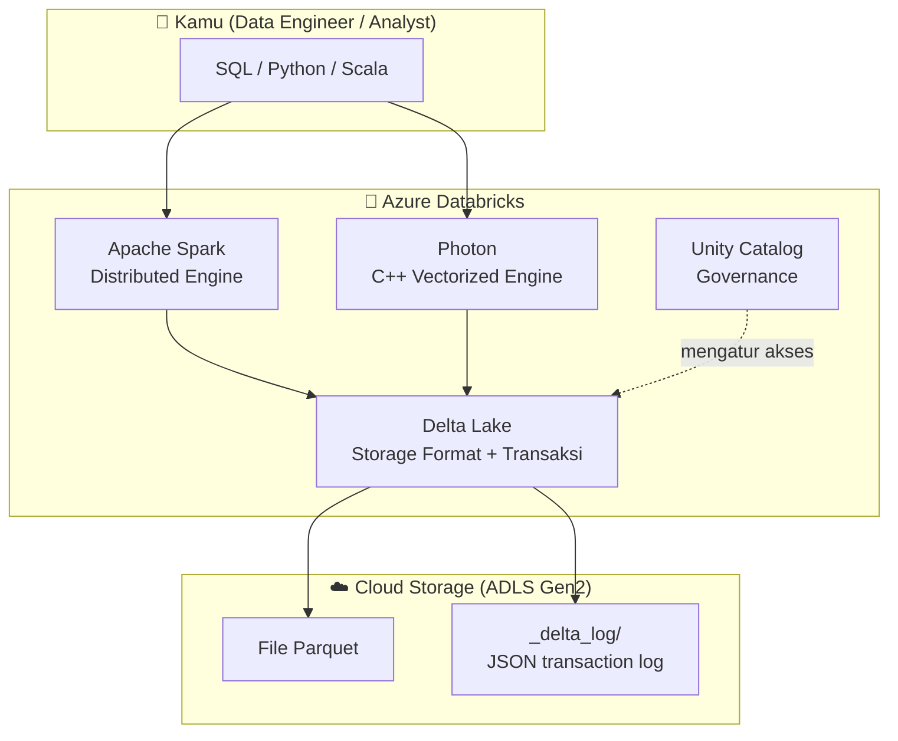
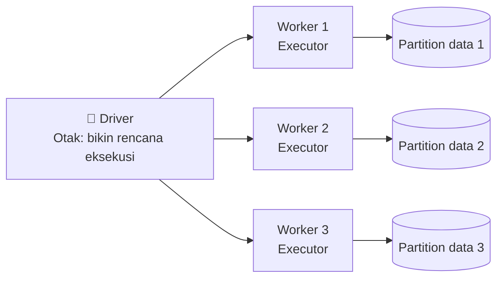
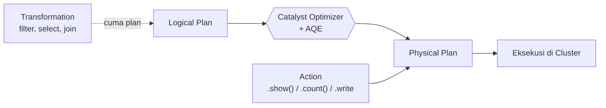
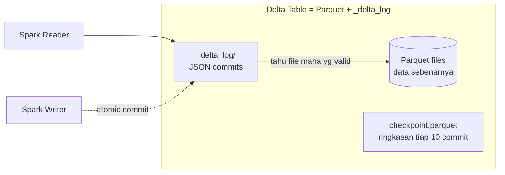
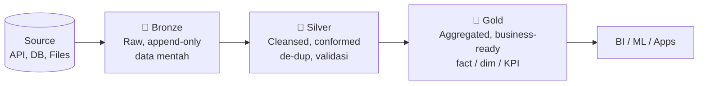
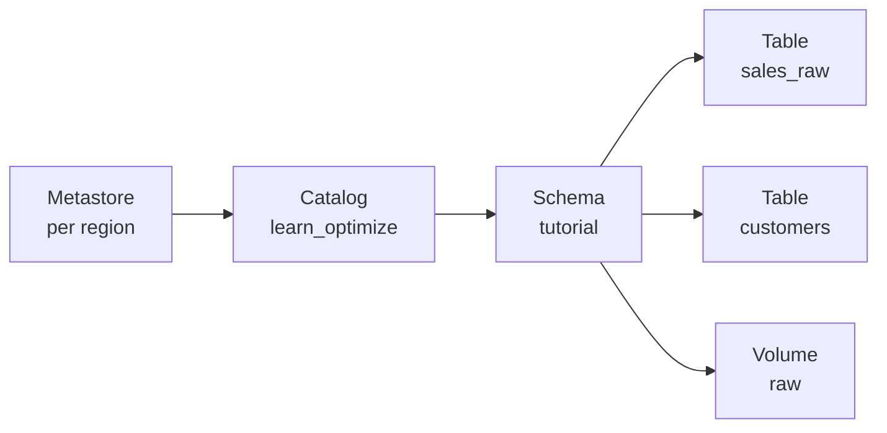
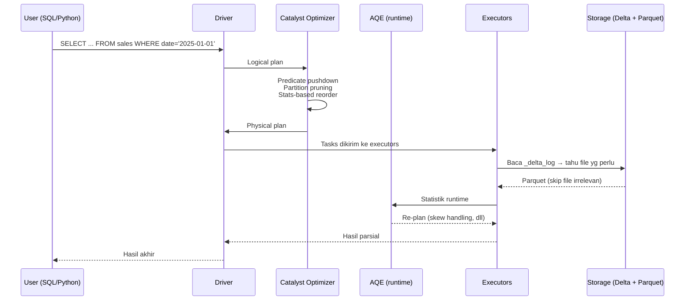

# Tutorial 00 — Konsep Dasar: Spark, Delta Lake & Lakehouse

> **Tujuan:** memberikan pondasi konsep yang dipakai di seluruh series. Kalau kamu masih bingung apa itu Spark, Delta Table, atau Lakehouse — **mulai dari sini dulu**, baru lanjut ke [Tutorial 01](01-setup-environment.md).
>
> Sumber resmi:
> - [Apache Spark on Azure Databricks](https://learn.microsoft.com/azure/databricks/spark/)
> - [What is Delta Lake?](https://learn.microsoft.com/azure/databricks/delta/)
> - [What is a data lakehouse?](https://learn.microsoft.com/azure/databricks/lakehouse/)
> - [Unity Catalog overview](https://learn.microsoft.com/azure/databricks/data-governance/unity-catalog/)

> 🏷️ **Cakupan Fitur** _(lihat [Legend di README](../README.md#-legend-ketersediaan-fitur))_
> - 🟢 **Apache Spark core** (Driver/Executor/Partition/Shuffle/Lazy eval) — OSS, [spark.apache.org](https://spark.apache.org/docs/latest/)
> - 🟢 **Delta Lake** (ACID, `_delta_log`, time travel, MERGE, schema enforcement) — OSS, [docs.delta.io](https://docs.delta.io/latest/)
> - 🟢 **Lakehouse / Medallion architecture** — konsep terbuka, dapat dijalankan di Spark+Delta OSS
> - 🟡 **Adaptive Query Execution (AQE)** — OSS Spark 3.0+ (default ON sejak 3.2), Databricks aktif by default
> - 🔵 **Unity Catalog**, **Photon**, **Disk Cache**, **Predictive Optimization**, **Databricks Runtime** — Databricks-only

---

## 🧭 Peta Konsep (gambar besar dulu)



**Cara baca:** kamu menulis SQL atau PySpark → Spark/Photon yang menjalankan → Delta Lake yang menyimpan data sebagai file Parquet + transaction log → Unity Catalog yang mengatur siapa boleh akses apa.

---

## 1. Apa itu Apache Spark?

[Apache Spark](https://learn.microsoft.com/azure/databricks/spark/) adalah **engine komputasi terdistribusi** untuk memproses data dalam jumlah besar. Ide dasarnya sederhana: kalau satu komputer tidak sanggup, **bagi pekerjaan ke banyak komputer (worker nodes)** lalu satukan hasilnya.



### Komponen yang wajib kamu kenal

| Istilah | Analogi sederhana |
|---|---|
| **Driver** | Manajer proyek — menerima perintah dari user, membagi kerja, mengumpulkan hasil. |
| **Executor** (worker) | Tukang — menjalankan tugas di sebagian data (partition). |
| **Cluster** | Tim = 1 driver + banyak executor. |
| **Partition** | Potongan data. Spark memproses banyak partition **paralel**. |
| **Task** | 1 unit kerja = 1 partition di 1 executor. |
| **Job / Stage** | Job = perintah besar (mis. `df.write`). Stage = bagian job yang bisa dikerjakan tanpa _shuffle_. |
| **Shuffle** | Pertukaran data antar executor (mis. saat `groupBy` atau `join`). **Mahal** karena lewat network + disk. |

> 💡 **Aturan praktis:** kalau workload kamu lambat, **80% kasusnya karena shuffle terlalu besar atau partition tidak imbang**. Hampir semua tutorial di series ini bertujuan mengurangi/menyehatkan shuffle.

### Lazy evaluation

Spark itu **malas** — sengaja. Ketika kamu menulis:

```python
df = spark.read.table("sales")
df2 = df.filter("amount > 100")
df3 = df2.groupBy("country").count()
```

…tidak ada yang dieksekusi. Spark cuma **mencatat rencana** (logical plan). Eksekusi baru terjadi saat kamu memanggil **action** seperti `.show()`, `.count()`, `.write...`.



Manfaatnya: optimizer ([Catalyst](https://learn.microsoft.com/azure/databricks/spark/) + [AQE](https://learn.microsoft.com/azure/databricks/optimizations/aqe)) bisa **menulis ulang query** kamu menjadi lebih efisien sebelum dijalankan.

### Spark di Databricks vs OSS Spark

Databricks Runtime = Apache Spark **+ banyak optimasi proprietary**:

- **Photon** → engine C++ vectorized (lihat [Photon docs](https://learn.microsoft.com/azure/databricks/compute/photon)).
- **Disk Cache** → cache otomatis Parquet ke SSD lokal.
- **Predictive I/O**, **Liquid Clustering**, **AQE default ON**, dll.

---

## 2. Apa itu Delta Lake?

[Delta Lake](https://learn.microsoft.com/azure/databricks/delta/) adalah **format penyimpanan open-source** yang membawa "kekuatan database" ke file di cloud storage.

Tanpa Delta, data lake kamu cuma **tumpukan file Parquet** — tidak ada transaksi, tidak ada history, tidak aman dari concurrent write. Dengan Delta, kamu dapat:

| Fitur | Artinya |
|---|---|
| **ACID transactions** | Read & write konkuren tidak akan saling merusak. |
| **Time travel** | `SELECT * FROM t VERSION AS OF 5` — kembali ke versi lama. |
| **Schema enforcement** | Tulis kolom ekstra → ditolak (kecuali pakai `mergeSchema`). |
| **Schema evolution** | Boleh tambah kolom baru saat write dengan opsi tertentu. |
| **MERGE / UPDATE / DELETE** | SQL DML penuh di atas data lake. |
| **Streaming + Batch unified** | Tabel yang sama bisa dibaca batch & streaming. |

### Anatomi Delta Table di storage

Coba `dbutils.fs.ls("abfss://.../sales/")` di sebuah Delta table, kamu akan lihat:

```
sales/
├── _delta_log/
│   ├── 00000000000000000000.json     ← transaction log (commit 0)
│   ├── 00000000000000000001.json     ← commit 1
│   ├── ...
│   └── 00000000000000000010.checkpoint.parquet   ← checkpoint (default tiap 10 commit, dapat diubah via `delta.checkpointInterval`)
├── part-00000-xxx.snappy.parquet     ← data file (Parquet)
├── part-00001-xxx.snappy.parquet
└── ...
```



> 🔑 **Inti Delta:** transaction log adalah _source of truth_. File Parquet di folder bisa banyak (termasuk file lama yang sudah tidak dipakai), tapi **hanya yang tercatat di log yang dianggap "isi" tabel**.

### Kenapa ini penting untuk optimisasi?

Karena log tahu **statistik per file** (min/max value tiap kolom, jumlah baris, ukuran), Spark bisa melakukan **data skipping** — _skip_ file yang pasti tidak relevan untuk query kamu. Ini fondasi untuk:

- File sizing & `OPTIMIZE` ([Tutorial 03](03-file-sizing-optimize.md))
- Z-Order / **Liquid Clustering** ([Tutorial 04](04-zorder-liquid-clustering.md))
- Partitioning ([Tutorial 05](05-partitioning.md))

---

## 3. Delta Table: Managed vs External

Di Unity Catalog ada dua jenis tabel utama:

| Jenis | Lokasi storage | Lifecycle |
|---|---|---|
| **Managed Table** (recommended) | Diatur oleh Unity Catalog di managed location catalog/schema. | `DROP TABLE` → file data **dihapus dari cloud storage setelah 8 hari** (grace period, bisa di-`UNDROP` dalam masa itu). Predictive Optimization, automatic liquid clustering, metadata caching aktif. |
| **External Table** | Path yang kamu tentukan sendiri (`LOCATION 'abfss://...'`). | `DROP TABLE` → metadata hilang, **file tetap ada** (harus dihapus manual). Tidak dapat sebagian fitur otomatis. |

> ⭐ **Best practice (per docs resmi):** untuk tabel baru, **pilih Managed Table**. Lihat [Unity Catalog managed tables](https://learn.microsoft.com/azure/databricks/tables/managed) dan perbandingan lengkap fitur (Predictive Optimization, automatic liquid clustering, metadata caching, automatic file deletion) di sana.

---

## 4. Lakehouse Architecture & Medallion

[Lakehouse](https://learn.microsoft.com/azure/databricks/lakehouse/) = **gabungan kelebihan Data Lake (murah, fleksibel, semua format) + Data Warehouse (transaksi, performa, governance)**, dimungkinkan oleh Delta Lake.

Pola standar pengaturan datanya disebut **Medallion Architecture**:



| Layer | Isinya | Contoh di series ini |
|---|---|---|
| **Bronze** | Persis seperti source, ditambah metadata (timestamp ingest, `_metadata.file_name`). Per docs: sebaiknya simpan field sebagai `string`/`VARIANT`/`binary` agar aman dari perubahan schema. | `sales_raw`, `iot_events_raw` |
| **Silver** | Sudah dibersihkan (schema enforcement, dedup, null handling, type casting, join). | `sales_clean` |
| **Gold** | Agregasi business-ready / dimensional model untuk BI/ML. | `sales_by_country_daily` |

Ref: [Medallion architecture](https://learn.microsoft.com/azure/databricks/lakehouse/medallion).

---

## 5. Unity Catalog (UC) sekilas

UC adalah lapisan **governance** 3-level untuk Lakehouse:



| Objek | Fungsi |
|---|---|
| **Metastore** | Top-level, biasanya 1 per region. |
| **Catalog** | Container utama — biasanya per environment / domain. |
| **Schema** (a.k.a. Database) | Container tabel/view/volume. |
| **Table** | Data terstruktur (Delta). |
| **Volume** | "Folder" di cloud storage untuk file non-tabular (CSV, JSON, image). |

Akses pakai **3-level name**: `catalog.schema.table`, mis. `learn_optimize.tutorial.sales_raw`.

---

## 6. Anatomi sebuah query: dari SQL → file



Hampir semua teknik optimisasi di series ini bekerja pada **salah satu kotak di atas**:

- File sizing / clustering → membantu langkah _"skip file irrelevan"_.
- Photon → mempercepat eksekusi di executor.
- AQE → optimasi rencana saat runtime.
- Disk Cache → menghindari re-fetch dari cloud storage.

---

## 7. Istilah lain yang sering muncul

| Istilah | Singkat |
|---|---|
| **DBU** (Databricks Unit) | Satuan billing Databricks (per jam compute). |
| **Workspace** | "Akun" Databricks per region. |
| **Cluster / SQL Warehouse** | Compute. Cluster untuk notebook/job, Warehouse khusus SQL. |
| **Notebook** | Editor interaktif (SQL/Python/Scala/R, mixed). |
| **Job** | Eksekusi terjadwal/otomatis dari notebook/script. |
| **DLT / LSDP** | [Lakeflow Spark Declarative Pipelines](https://learn.microsoft.com/azure/databricks/dlt/) (penerus Delta Live Tables). |
| **Auto Loader** | Source streaming `cloudFiles` untuk ingest file inkremental. |
| **OPTIMIZE / VACUUM** | Maintenance command Delta (compaction & cleanup). |

---

## ✅ Checklist sebelum lanjut

- [ ] Saya paham bedanya **Driver** dan **Executor**.
- [ ] Saya tahu kenapa **shuffle** itu mahal.
- [ ] Saya bisa menjelaskan apa isi folder Delta Table (`_delta_log` + Parquet).
- [ ] Saya tahu beda **Managed vs External Table**.
- [ ] Saya hafal urutan **Bronze → Silver → Gold**.
- [ ] Saya mengerti hierarki **Catalog → Schema → Table** di Unity Catalog.

Kalau semua sudah dicentang → lanjut ke **[Tutorial 01 — Setup Environment](01-setup-environment.md)** 🚀

---

## 📖 Bacaan lanjutan (resmi)

- [Apache Spark on Databricks — Overview](https://learn.microsoft.com/azure/databricks/spark/)
- [Delta Lake — Concepts](https://learn.microsoft.com/azure/databricks/delta/)
- [Delta transaction log protocol](https://github.com/delta-io/delta/blob/master/PROTOCOL.md)
- [What is a data lakehouse?](https://learn.microsoft.com/azure/databricks/lakehouse/)
- [Medallion architecture](https://learn.microsoft.com/azure/databricks/lakehouse/medallion)
- [Unity Catalog overview](https://learn.microsoft.com/azure/databricks/data-governance/unity-catalog/)
- [Databricks Runtime release notes](https://learn.microsoft.com/azure/databricks/release-notes/runtime/)
