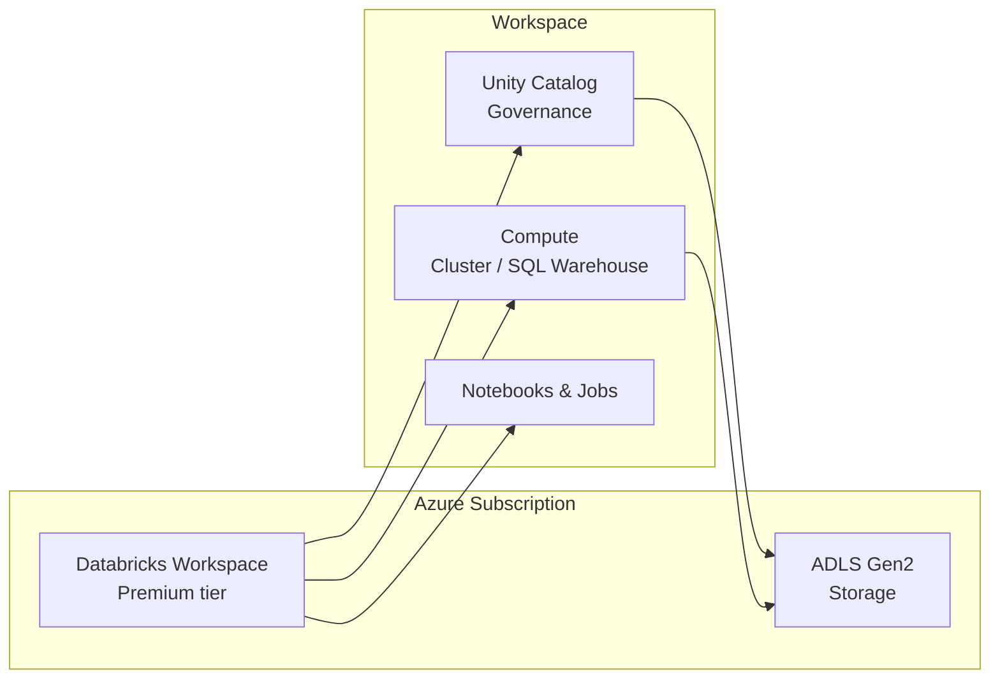

# Tutorial 01 — Setup Environment

> Tujuan: menyiapkan **Azure Databricks Workspace**, **cluster**, dan **Unity Catalog** sebagai pondasi untuk semua tutorial berikutnya.

> 🏷️ **Cakupan Fitur** _(lihat [Legend](../README.md#-legend-ketersediaan-fitur))_
> - 🔵 **Azure Databricks Workspace**, **Cluster modes** (All-purpose, Job, SQL Warehouse), **Unity Catalog** — Databricks-only
> - 🔵 **Photon runtime toggle** — Databricks-only
> - 🟢 Konsep cluster (driver/worker/autoscaling) berlaku umum di Apache Spark

---

## 🧠 Konsep Dasar

Azure Databricks terdiri dari beberapa komponen penting:



| Komponen | Fungsi |
|----------|--------|
| **Workspace** | UI utama tempat kerja. |
| **Unity Catalog** | Governance & permission terpusat. **Wajib** untuk Predictive Optimization. |
| **Cluster / SQL Warehouse** | Mesin Spark/Photon yang menjalankan query. |
| **ADLS Gen2** | Storage di balik Delta Lake. |

---

## 🛠️ Langkah-langkah

### 1. Buat Azure Databricks Workspace

1. Login ke [Azure Portal](https://portal.azure.com).
2. **Create a resource → Azure Databricks**.
3. Pilih **Pricing tier = Premium** (butuh untuk Unity Catalog & Photon).
4. Region: **pilih yang dekat dengan storage data kamu** (mis. Southeast Asia).
5. Klik **Review + Create**.

> ⏱️ Provisioning ±5 menit.

### 2. Aktifkan Unity Catalog

Ikuti petunjuk: [Set up Unity Catalog](https://learn.microsoft.com/azure/databricks/data-governance/unity-catalog/get-started).

Singkatnya:
1. Buat **Access Connector for Azure Databricks** (managed identity).
2. Beri role **Storage Blob Data Contributor** ke ADLS Gen2 container.
3. Buat **metastore** di account console → assign ke workspace.

### 3. Buat Cluster

Di workspace → **Compute → Create compute**:

| Setting | Nilai Rekomendasi |
|---------|-------------------|
| **Policy** | Personal Compute (atau Job/Shared) |
| **Databricks Runtime** | `15.4 LTS` (atau lebih baru) — Photon edition |
| **Node type** | `Standard_E8ds_v5` (memory + SSD untuk disk cache) |
| **Workers** | 2 - 8 (autoscale) |
| **Photon** | ✅ ON |
| **Auto-termination** | 30 menit |

> 💡 Untuk SQL workload, **lebih bagus pakai SQL Warehouse Serverless** — Photon, autoscaling, startup <10 detik.

### 4. Buat Catalog, Schema, Volume

Buka **SQL Editor** atau notebook baru, jalankan [scripts/01_setup_catalog.sql](../scripts/01_setup_catalog.sql) atau:

```sql
CREATE CATALOG IF NOT EXISTS learn_optimize;
CREATE SCHEMA  IF NOT EXISTS learn_optimize.tutorial;
CREATE VOLUME  IF NOT EXISTS learn_optimize.tutorial.raw;
```

### 5. (Opsional) Aktifkan Predictive Optimization

```sql
ALTER CATALOG learn_optimize ENABLE PREDICTIVE OPTIMIZATION;
```

Predictive Optimization menjalankan `OPTIMIZE`, `VACUUM`, `ANALYZE` otomatis di tabel UC managed → **sangat dianjurkan**.
Docs: <https://learn.microsoft.com/azure/databricks/optimizations/predictive-optimization>.

### 6. Import Folder `scripts/`

Cara termudah:

- **VS Code Extension Databricks** → `Sync to Workspace`.
- atau **Workspace UI → Import → Folder** → upload zip.
- atau **Databricks CLI**: `databricks workspace import-dir scripts/ /Users/<you>/optimize-tutorial`.

---

## ✅ Checklist

- [ ] Workspace Premium aktif.
- [ ] Unity Catalog metastore ter-assign.
- [ ] Cluster DBR 15.4 LTS + Photon dapat di-start.
- [ ] Bisa menjalankan `SELECT current_user()` di SQL Editor.
- [ ] Catalog `learn_optimize` terbuat.

Jika semua ✓ → lanjut ke [Tutorial 02 — Sample Data](02-sample-data.md).

---

## 📚 Referensi
- [Azure Databricks Quickstart](https://learn.microsoft.com/azure/databricks/getting-started/)
- [Performance best practices](https://learn.microsoft.com/azure/databricks/lakehouse-architecture/performance-efficiency/best-practices)
