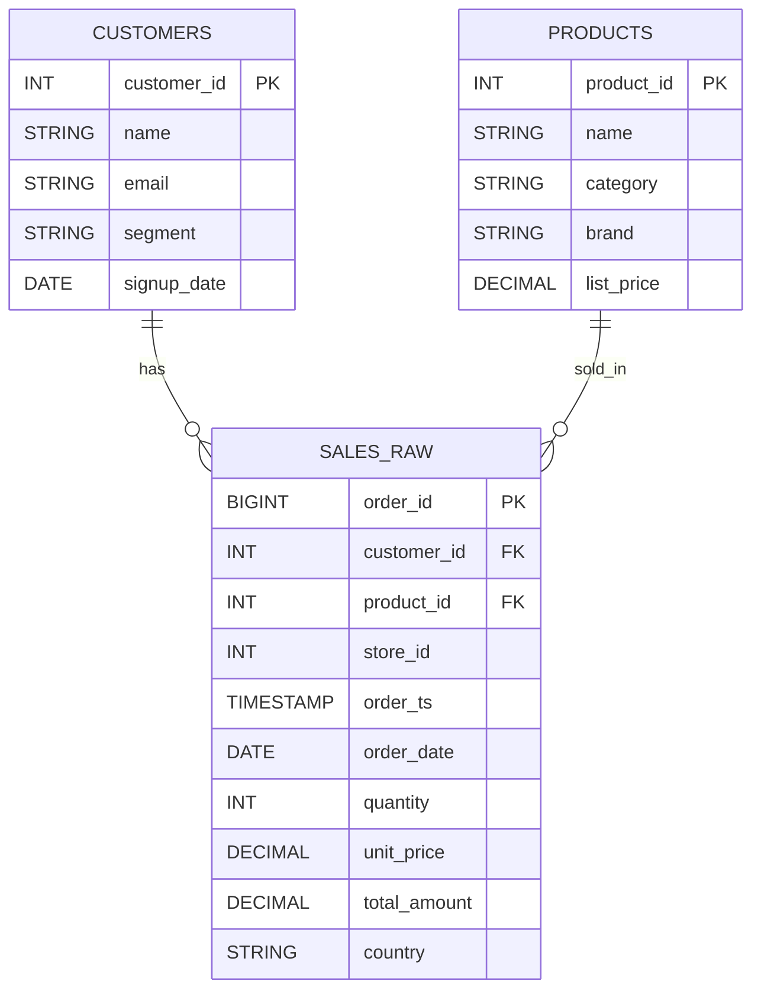

# Tutorial 02 — Generate Sample Data

> Tujuan: men-generate dataset **realistis** (100 jt baris penjualan) yang sengaja **tidak optimal** sehingga kita punya bahan untuk dioptimasi di tutorial berikutnya.

> 🏷️ **Cakupan Fitur** _(lihat [Legend](../README.md#-legend-ketersediaan-fitur))_
> - 🟢 **PySpark DataFrame API**, **Spark SQL**, **Delta table writes** — semua OSS
> - 🟢 **`spark.range`**, `repartition`, `withColumn` — OSS
> - 🔵 Penyimpanan ke **Unity Catalog Volume** (`/Volumes/...`) — Databricks-only (di OSS gunakan path HDFS/S3/ABFS biasa)

---

## 🧠 Mengapa Data Sintetis?

| Alasan | Penjelasan |
|--------|------------|
| **Volume terkontrol** | bisa di-scale 1 jt → 1 milyar baris dalam beberapa menit. |
| **Skew sengaja** | 60% data di country `ID` → demo skew handling. |
| **High vs low cardinality** | bisa demo partition vs clustering. |
| **Reproducible** | semua orang dapat hasil sama. |

---

## 📐 Skema



---

## 🛠️ Cara Menjalankan

1. Buka notebook [scripts/02_generate_sample_data.py](../scripts/02_generate_sample_data.py).
2. Pastikan cell pertama `%run ./00_config` sukses.
3. (Opsional) Ubah `NUM_ORDERS` jika cluster kecil:
   - Single-node trial → `10_000_000`.
   - 2 worker DS3v2 → `30_000_000`.
   - 8 worker E8dsv5 → `100_000_000` (default).
4. **Run All**. Estimasi 5-15 menit untuk 100 jt baris.

### Verifikasi

```sql
SELECT count(*) FROM learn_optimize.tutorial.sales_raw;
SELECT country, count(*) FROM learn_optimize.tutorial.sales_raw GROUP BY country;
```

Hasil distribusi country harus terlihat **skewed** (`ID` ±60%).

---

## ⚠️ Mengapa Sengaja Tidak Optimal?

Script menulis dengan `repartition(800)` → menghasilkan **±800 file kecil**.
Ini meniru **small file problem** yang sangat umum di lakehouse production:
- File yang dihasilkan streaming sering kali < 10 MB.
- Banyak `INSERT` kecil → menumpuk file.

Tutorial 03 akan men-compact-nya dengan `OPTIMIZE`.

---

## 🧹 Cleanup

Untuk hapus semua tabel tutorial:

```sql
DROP SCHEMA learn_optimize.tutorial CASCADE;
```

---

## ➡️ Selanjutnya

[Tutorial 03 — File Sizing & OPTIMIZE](03-file-sizing-optimize.md)
