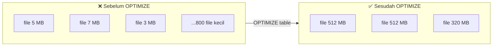

# Tutorial 03 — File Sizing & `OPTIMIZE`

> Tujuan: memahami **small file problem**, cara mendeteksinya, dan memperbaikinya dengan `OPTIMIZE` + auto-compaction.

> 🏷️ **Cakupan Fitur** _(lihat [Legend](../README.md#-legend-ketersediaan-fitur))_
> - 🟢 **`OPTIMIZE` (bin-packing/compaction)** — OSS Delta Lake **1.2+** ([docs.delta.io/optimizations-oss](https://docs.delta.io/latest/optimizations-oss.html))
> - 🟢 **`VACUUM`**, **`DESCRIBE DETAIL`** — OSS Delta
> - 🟢 **Optimized Write** (`delta.autoOptimize.optimizeWrite`) — OSS Delta **3.1+** (sebelumnya Databricks-only)
> - 🟢 **Auto Compaction** (`delta.autoOptimize.autoCompact`) — OSS Delta **3.1+**
> - 🔵 **Predictive Optimization** (auto-`OPTIMIZE`/`VACUUM` terkelola) — Databricks-only ([learn.microsoft.com](https://learn.microsoft.com/azure/databricks/optimizations/predictive-optimization))

---

## 🧠 Konsep

Setiap file Parquet di Delta Lake memiliki **overhead** (open, footer, metadata).
- **Terlalu banyak file kecil** → driver kewalahan list, scheduler overhead besar.
- **Terlalu sedikit file besar** → paralelisme rendah, partial read mahal.

Target Databricks: **256 MB – 1 GB per file** (auto-tuned tergantung ukuran tabel).



---

## 🛠️ Langkah Demo

Pakai [scripts/03_optimize_compaction.sql](../scripts/03_optimize_compaction.sql).

### 1. Lihat statistik tabel

```sql
DESCRIBE DETAIL learn_optimize.tutorial.sales_raw;
```

Kolom penting:
- `numFiles` — biasanya ~800 (kecil).
- `sizeInBytes` — total ukuran tabel.
- `sizeInBytes / numFiles` — rata-rata file size.

### 2. Query baseline & catat waktu

Buka **Query Profile** (kanan atas hasil query) → catat:
- Wall time
- "Files read"
- "Bytes read"

### 3. Jalankan `OPTIMIZE`

```sql
OPTIMIZE learn_optimize.tutorial.sales_raw;
```

### 4. Re-run query, bandingkan

Anda akan melihat:
- `numFiles` turun drastis (ratusan → puluhan).
- Wall time query 2-10× lebih cepat.

### 5. Aktifkan **Auto Optimize** untuk write berikutnya

```sql
ALTER TABLE learn_optimize.tutorial.sales_raw SET TBLPROPERTIES (
  'delta.autoOptimize.optimizeWrite' = 'true',
  'delta.autoOptimize.autoCompact'   = 'true'
);
```

| Property | Fungsi |
|----------|--------|
| `optimizeWrite` | Saat write, Spark melakukan extra shuffle agar file output langsung ber-ukuran ideal. |
| `autoCompact`   | Setelah write, kalau ada banyak file kecil → auto-trigger mini-compaction. |

### 6. `VACUUM`

`OPTIMIZE` **tidak menghapus** file lama (untuk time travel). Untuk reclaim storage:

```sql
VACUUM learn_optimize.tutorial.sales_raw;   -- default 7 hari retention
```

⚠️ **Jangan** turunkan retention < 7 hari di production tanpa pertimbangan matang.

---

## 🤖 Lebih Mudah: Predictive Optimization

Kalau tabel sudah **Unity Catalog managed** + Predictive Optimization aktif:

```sql
ALTER CATALOG learn_optimize ENABLE PREDICTIVE OPTIMIZATION;
```

Maka Databricks **otomatis** menjalankan `OPTIMIZE` dan `VACUUM` di belakang layar — kamu tidak perlu schedule sendiri.

Docs: <https://learn.microsoft.com/azure/databricks/optimizations/predictive-optimization>

---

## 💡 Best Practices Resmi

- Kalau pakai Predictive Optimization → matikan job schedule `OPTIMIZE` manual.
- Pakai `OPTIMIZE` di luar jam sibuk untuk tabel besar non-managed.
- Untuk streaming: gabungkan `optimizeWrite` + small batch interval (≥5 menit).

---

## ➡️ Selanjutnya

[Tutorial 04 — Z-Order & Liquid Clustering](04-zorder-liquid-clustering.md)
