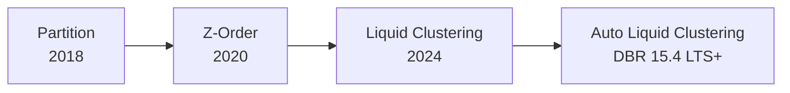

# Tutorial 04 — Z-Order & Liquid Clustering

> Tujuan: belajar **data skipping** lewat clustering keys. Liquid Clustering adalah **rekomendasi resmi** Databricks untuk semua tabel baru.

> 🏷️ **Cakupan Fitur** _(lihat [Legend](../README.md#-legend-ketersediaan-fitur))_
> - 🟢 **Data skipping (min/max stats)** — OSS Delta 1.2+
> - 🟢 **`ZORDER BY`** — OSS Delta **2.0+**
> - 🟢 **Liquid Clustering manual** (`CLUSTER BY (col)`) — OSS Delta **3.1+** ([docs.delta.io/delta-clustering](https://docs.delta.io/latest/delta-clustering.html))
> - 🟢 **`ALTER TABLE ... CLUSTER BY`** & **`OPTIMIZE FULL`** — OSS Delta **3.3+**
> - 🔵 **`CLUSTER BY AUTO`** (automatic clustering keys) — Databricks-only
> - 🔵 Integrasi Liquid Clustering dengan **Predictive Optimization** — Databricks-only

---

## 🧠 Konsep: Data Skipping

Delta Lake menyimpan **min/max value** tiap kolom di setiap file. Saat query:

```sql
WHERE order_date = '2024-06-15'
```

Spark hanya buka file yang **min ≤ '2024-06-15' ≤ max**. Sisanya diskip.
Tapi efektivitas data skipping bergantung pada **bagaimana data tersusun di file**.

---

## 📊 Tiga Strategi Layout (evolusi)

| Strategi | Kelebihan | Kekurangan |
|----------|-----------|-----------|
| **Partition** (`PARTITIONED BY`) | Skipping cepat untuk filter exact partition. | Statis, susah diubah, bahaya over-partition. |
| **Z-Order** (legacy) | Multi-dimensional skipping. | Butuh full rewrite setiap `OPTIMIZE ZORDER`, mahal. |
| **Liquid Clustering** ⭐ | Incremental, bisa ganti keys tanpa rewrite, multi-key. | Butuh DBR ≥ 13.3 LTS, writer protocol baru. |



---

## 🛠️ Demo

Pakai [scripts/04_liquid_clustering.sql](../scripts/04_liquid_clustering.sql).

### A. Buat tabel ber-cluster

```sql
CREATE OR REPLACE TABLE learn_optimize.tutorial.sales_clustered
CLUSTER BY (order_date, country) AS
SELECT * FROM learn_optimize.tutorial.sales_raw;

OPTIMIZE learn_optimize.tutorial.sales_clustered;
```

### B. Query dengan filter pada cluster keys

```sql
SELECT product_id, sum(total_amount) rev
FROM   learn_optimize.tutorial.sales_clustered
WHERE  order_date BETWEEN '2024-06-01' AND '2024-06-30'
  AND  country = 'ID'
GROUP BY product_id;
```

Buka **Query Profile** → lihat metric **"Files pruned"** vs **"Files read"**. Idealnya >70% file di-prune.

### C. Ganti cluster keys (tanpa rewrite!)

```sql
ALTER TABLE learn_optimize.tutorial.sales_clustered
CLUSTER BY (customer_id, order_date);
```

Data lama tidak di-rewrite. Hanya data baru yang di-cluster ulang. Untuk paksa:

```sql
OPTIMIZE learn_optimize.tutorial.sales_clustered FULL;
```

### D. Auto Liquid Clustering (DBR 15.4 LTS+)

Biarkan Databricks memilih sendiri keys terbaik dari pola query historis:

```sql
ALTER TABLE learn_optimize.tutorial.sales_clustered CLUSTER BY AUTO;
```

---

## 📋 Aturan Pemilihan Cluster Keys

> Resmi dari [Liquid Clustering docs](https://learn.microsoft.com/azure/databricks/delta/clustering#choose-clustering-keys):

1. Pilih kolom yang **sering dipakai di `WHERE`**.
2. Maksimal **4 kolom** (lebih dari ini malah turunkan performa untuk tabel <10 TB).
3. Hanya tipe: Date, Timestamp, String, Integer, Long, Short, Byte, Float, Double, Decimal.
4. Hanya kolom yang **terkumpul statistik-nya** (default 32 kolom pertama).
5. Kalau dua kolom sangat berkorelasi → cukup pilih satu.

---

## ⚠️ Yang Tidak Kompatibel

- **Tidak bisa** mengkombinasikan Liquid Clustering dengan `PARTITIONED BY`.
- **Tidak bisa** dipadukan dengan `ZORDER BY`.
- Tabel di-upgrade ke writer v7 / reader v3 → reader lama tidak bisa baca.

---

## 🆚 Vs Z-Order

| Aspek | Z-ORDER | Liquid Clustering |
|-------|---------|-------------------|
| Rewrite cost | Penuh setiap kali | Incremental |
| Ganti keys | Harus rewrite | `ALTER TABLE CLUSTER BY (...)` |
| Concurrency write | Lebih sering konflik | Lebih ramah |
| Status | Legacy | **Direkomendasikan** |

---

## ➡️ Selanjutnya

[Tutorial 05 — Partitioning Strategy](05-partitioning.md)
