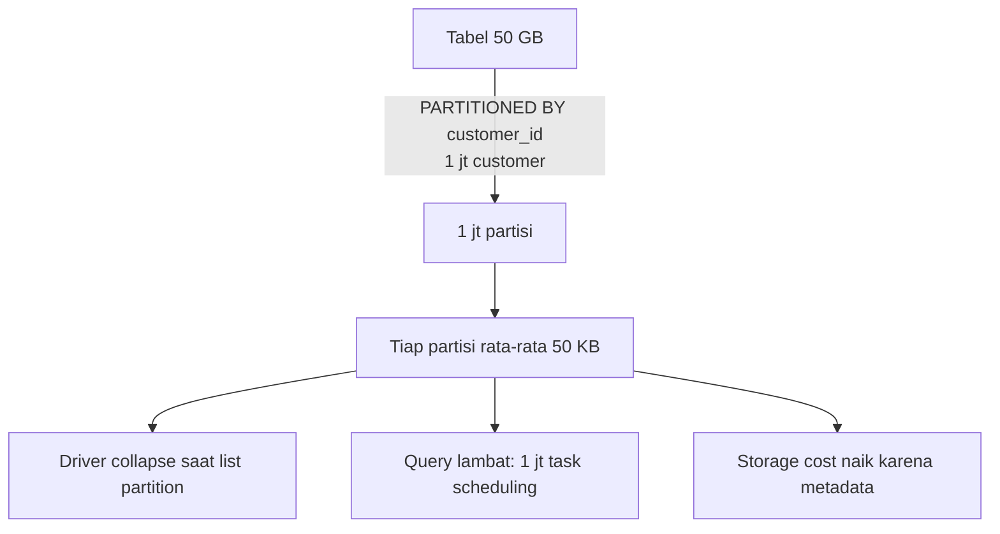

# Tutorial 05 — Partitioning Strategy

> Tujuan: paham **kapan** partitioning membantu, **kapan** justru merusak performa, dan **kenapa Liquid Clustering hampir selalu lebih baik**.

> 🏷️ **Cakupan Fitur** _(lihat [Legend](../README.md#-legend-ketersediaan-fitur))_
> - 🟢 **Hive-style partitioning** (`PARTITIONED BY`) — OSS Spark/Delta
> - 🟢 **Generated columns** untuk partition pruning — OSS Delta
> - 🟢 **Liquid Clustering** sebagai pengganti partitioning — OSS Delta 3.1+
> - 🔵 Rekomendasi & threshold **"jangan partition tabel < 1 TB"** — best practice resmi Databricks/MS Learn

---

## 🧠 Aturan Resmi (Microsoft Learn)

> ❌ **Jangan** partition tabel yang ukurannya **< 1 TB**.
> ❌ **Jangan** partition kalau setiap partisi **< 1 GB**.
> ✅ Untuk tabel baru → pakai **Liquid Clustering**.

Source: <https://learn.microsoft.com/azure/databricks/lakehouse-architecture/performance-efficiency/best-practices#avoid-over-partitioning>

---

## 🚨 Bahaya Over-Partitioning



---

## 🛠️ Demo

Pakai [scripts/05_partitioning_demo.py](../scripts/05_partitioning_demo.py).

Skript membuat:
- `sales_bad_partition` → `PARTITIONED BY (customer_id)` — **JELEK** (high cardinality).
- `sales_good_partition` → `PARTITIONED BY (order_date)` — wajar.
- `sales_clustered` (dari tutorial 04) — **TERBAIK**.

Lalu jalankan query yang sama di tiga tabel & bandingkan:

```python
for tbl in ["sales_bad_partition", "sales_good_partition", "sales_clustered"]:
    detail = spark.sql(f"DESCRIBE DETAIL {FQN(tbl)}").collect()[0].asDict()
    print(tbl, "files=", detail["numFiles"], "MB=", detail["sizeInBytes"]/1024/1024)
```

Hasil tipikal:

| Tabel | numFiles | Catatan |
|-------|---------|--------|
| `sales_bad_partition`  | ratusan ribu | 🚨 small files everywhere |
| `sales_good_partition` | ribuan | OK untuk filter by date |
| `sales_clustered`      | puluhan | terbaik |

---

## ✅ Kapan Partitioning Masih OK

1. Tabel **sangat besar** (≥10 TB) **dan** ada filter natural (mis. `event_date`).
2. Anda butuh **partition pruning** lintas catalog (mis. write-to-different-locations).
3. Workload streaming dengan **late-arriving data** kecil → partition by date.

Untuk semua kasus lain: pakai Liquid Clustering.

---

## 🔄 Migrasi dari Partitioning ke Liquid Clustering

```sql
-- 1. Disable partition (rekomendasi: rebuild table).
CREATE OR REPLACE TABLE my_catalog.my_schema.my_table
CLUSTER BY (date_col, country_col) AS
SELECT * FROM my_catalog.my_schema.my_table_old;

-- 2. Atau enable clustering pada tabel UNPARTITIONED existing:
ALTER TABLE my_table CLUSTER BY (date_col);
OPTIMIZE my_table FULL;
```

> ⚠️ Liquid Clustering **tidak bisa** dipakai pada tabel yang sudah `PARTITIONED BY`.

---

## ➡️ Selanjutnya

[Tutorial 06 — Caching & Disk Cache](06-caching.md)
