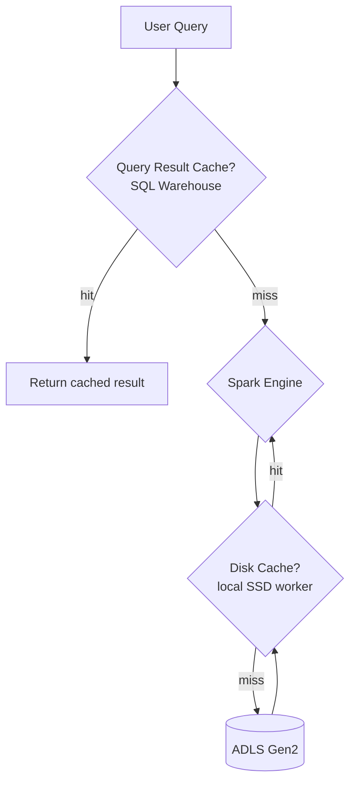

# Tutorial 06 — Caching & Disk Cache

> Tujuan: paham **disk cache** (Databricks-native) vs **Spark cache**, dan kapan pakai apa.

> 🏷️ **Cakupan Fitur** _(lihat [Legend](../README.md#-legend-ketersediaan-fitur))_
> - 🟢 **Spark cache** — `.cache()`, `.persist()`, `CACHE TABLE`, `spark.catalog.cacheTable()` — OSS ([spark.apache.org caching](https://spark.apache.org/docs/latest/sql-performance-tuning.html#caching-data))
> - 🔵 **Disk Cache (SSD)** — `spark.databricks.io.cache.*` — Databricks-only
> - 🔵 **Query Result Cache** (Databricks SQL) — Databricks-only
> - 🔵 **Photon disk cache integration** — Databricks-only

---

## 🧠 Tiga Lapis Cache di Azure Databricks



| Lapis | Lokasi | Otomatis? | Untuk apa? |
|-------|--------|-----------|------------|
| **Query Result Cache** | SQL Warehouse | ✅ | Result query deterministik (SQL Warehouse) |
| **Disk Cache** | SSD lokal worker | ✅ | Parquet/Delta files yang dibaca |
| **Spark Cache** (`.cache()`) | Memori executor | ❌ manual | DataFrame intermediate (jarang dianjurkan) |

---

## 📌 Disk Cache (yang utama)

- Dulu disebut "Delta cache" / "DBIO cache".
- **Otomatis** aktif kalau worker pakai instance type ber-SSD (mis. `Standard_E8ds_v5`, `L*s_v3`).
- Menyimpan **kopi Parquet** ke SSD lokal → query berikutnya 5-10× lebih cepat.
- **Konsisten otomatis** — kalau file diubah/dihapus, cache di-invalidate.

### Cek status

```python
spark.conf.get("spark.databricks.io.cache.enabled")
```

### Tuning manual (jarang perlu)

```ini
spark.databricks.io.cache.maxDiskUsage           50g
spark.databricks.io.cache.maxMetaDataCache        1g
spark.databricks.io.cache.compression.enabled  false
```

### Tip pre-warming

```python
spark.sql("SELECT count(*) FROM big_table WHERE date >= current_date - INTERVAL 30 DAYS").show()
```

Jalankan via Databricks Workflow tiap pagi → user pertama langsung dapat cache hit.

---

## ❌ Hindari Spark Cache untuk Delta

Resmi: **"Do not use Spark caching with Delta Lake"** ([source](https://learn.microsoft.com/azure/databricks/delta/best-practices#do-not-use-spark-caching-with-delta-lake)).

Alasan:
1. Anda **kehilangan data skipping** untuk filter tambahan.
2. Data yang di-cache bisa **stale** kalau tabel di-update lewat path lain.
3. Bisa OOM kalau dataset terlalu besar.

Boleh pakai **hanya** kalau:
- Data bukan Delta (CSV/JSON kompleks ETL intermediate).
- DataFrame hasil komputasi mahal yang dipakai berulang dalam **satu** job.

---

## 🛠️ Demo

[scripts/06_caching_demo.py](../scripts/06_caching_demo.py)

Output tipikal:
```
COLD     rows= 12,345  elapsed=18.40s
WARM-1   rows= 12,345  elapsed= 2.10s
WARM-2   rows= 12,345  elapsed= 1.98s
```

> 🔥 Hampir **10× speedup** hanya karena disk cache hit.

---

## ➡️ Selanjutnya

[Tutorial 07 — Joins, Broadcast & AQE](07-joins-aqe.md)
