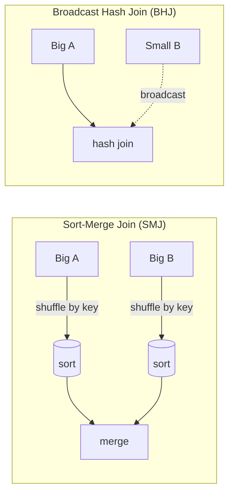

# Tutorial 07 — Joins, Broadcast & Adaptive Query Execution (AQE)

> Tujuan: paham bagaimana Spark memilih join strategy, kapan **broadcast**, dan bagaimana **AQE** memperbaiki rencana eksekusi saat runtime.

> 🏷️ **Cakupan Fitur** _(lihat [Legend](../README.md#-legend-ketersediaan-fitur))_
> - 🟢 **Adaptive Query Execution (AQE)** — OSS Spark **3.0+**, default **ON sejak Spark 3.2** ([spark.apache.org AQE](https://spark.apache.org/docs/latest/sql-performance-tuning.html#adaptive-query-execution))
> - 🟢 **Broadcast hash join** & hint `/*+ BROADCAST(t) */` — OSS
> - 🟢 **`spark.sql.autoBroadcastJoinThreshold`** (default 10 MB) — OSS
> - 🟢 **`spark.sql.adaptive.skewJoin.enabled`**, `coalescePartitions`, `localShuffleReader` — OSS Spark 3.0+
> - 🟢 **`spark.sql.adaptive.autoBroadcastJoinThreshold`** — OSS Spark 3.2+
> - 🟢 **`ANALYZE TABLE ... COMPUTE STATISTICS`** — OSS Spark
> - 🟡 Default AQE configs di Databricks Runtime sering lebih agresif daripada OSS

---

## 🧠 Mengapa Join Itu Mahal?

Join besar = **shuffle** data antar node lewat jaringan. Strategi yang salah dapat membuat job berjam-jam.



**Aturan praktis:** kalau salah satu side **< 30 MB** (default `spark.databricks.adaptive.autoBroadcastJoinThreshold`) → AQE auto-pakai BHJ.

---

## 🚀 Adaptive Query Execution (AQE)

AQE **default ON** sejak DBR 7.3. 4 fitur utamanya:

| Fitur | Kerjanya |
|-------|----------|
| **Dynamic switch SMJ → BHJ** | Setelah shuffle, statistik real diketahui. Kalau ternyata satu sisi cukup kecil → switch ke BHJ. |
| **Coalesce shuffle partitions** | Gabung partisi kecil hasil shuffle (target `64 MB`) → kurangi task overhead. |
| **Skew join handling** | Partisi yang > 5× median + > 256 MB dipecah. |
| **Empty relation propagation** | Kalau salah satu sisi kosong → seluruh subtree diganti `LocalTableScan` kosong. |

Cek konfigurasi:

```python
spark.conf.get("spark.databricks.optimizer.adaptive.enabled")              # true
spark.conf.get("spark.sql.adaptive.skewJoin.enabled")                      # true
spark.conf.get("spark.sql.adaptive.coalescePartitions.enabled")            # true
spark.conf.get("spark.databricks.adaptive.autoBroadcastJoinThreshold")     # 30MB
```

---

## 🛠️ Demo

Pakai [scripts/07_joins_aqe_demo.py](../scripts/07_joins_aqe_demo.py).

### A. Auto Broadcast

```python
df.explain(mode="formatted")
# Cari: BroadcastHashJoin (build side: products)
```

### B. Manual broadcast hint

```python
from pyspark.sql.functions import broadcast
sales.join(broadcast(products), "product_id")
```

> Kapan pakai hint manual?
> Kalau **ukuran side kecil** baru ketahuan setelah filter dinamis (AQE bisa miss).

### C. Skew handling otomatis

Karena 60% data ber-`country='ID'`, join ke `customers` akan skew di key tertentu. Lihat di Spark UI:
**SortMergeJoin** node punya `isSkew=true` → AQE otomatis pecah partisi besar.

### D. Auto-optimized shuffle

```python
spark.conf.set("spark.sql.shuffle.partitions", "auto")
```

Default 200; "auto" membuat Spark pilih jumlah berdasarkan input size.

### E. `ANALYZE TABLE` untuk CBO

```sql
ANALYZE TABLE my_table COMPUTE STATISTICS FOR ALL COLUMNS;
```

Cost-Based Optimizer butuh statistik akurat untuk memilih join order. Predictive Optimization akan menjalankan ini otomatis.

---

## 🤔 FAQ

**Q: AQE tidak men-broadcast tabel kecil saya?**
- Cek apakah join type-nya supported (LEFT OUTER tidak bisa broadcast left side).
- Cek `spark.sql.adaptive.nonEmptyPartitionRatioForBroadcastJoin`.

**Q: Skew join hint vs AQE?**
- Pakai AQE saja, lebih otomatis & adaptif.

**Q: AQE me-reorder join?**
- **Tidak.** Reorder masih job CBO + table statistics.

---

## ➡️ Selanjutnya

[Tutorial 08 — Photon & Cluster Sizing](08-photon-cluster.md)
