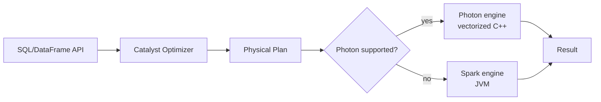

# Tutorial 08 — Photon & Cluster Sizing

> Tujuan: paham apa itu **Photon engine**, kapan benar-benar membantu, dan bagaimana **memilih ukuran cluster** yang optimal.

> 🏷️ **Cakupan Fitur** _(lihat [Legend](../README.md#-legend-ketersediaan-fitur))_
> - 🔵 **Photon engine** (vectorized C++ engine) — Databricks-only ([learn.microsoft.com Photon](https://learn.microsoft.com/azure/databricks/compute/photon))
> - 🔵 **Databricks instance types** (Standard_DS3_v2, dsb.) & **Autoscaling** dengan worker types Databricks — Databricks-only
> - 🔵 **`spark.databricks.clusterUsageTags.runtimeEngine`** — Databricks-only metadata
> - 🟢 Konsep **executor sizing**, **memory tuning**, **shuffle partitions** berlaku umum untuk semua Apache Spark

---

## ⚡ Apa itu Photon?

Photon adalah **vectorized query engine** Databricks-native, ditulis dalam **C++**, kompatibel dengan Spark API.

### Yang Disupport Photon

✅ Scan, filter, project, aggregate, hash join, sort, window
✅ Delta/Parquet read & write
✅ `MERGE`, `UPDATE`, `DELETE`, `INSERT`, `CTAS`
✅ Predictive I/O (butuh Photon)
✅ Dynamic file pruning di MERGE/UPDATE/DELETE

### Yang Tidak Disupport

❌ Python/Scala UDF (akan fallback ke Spark)
❌ RDD / Dataset API
❌ Stateful streaming

> Kalau workload pakai operator yang tidak didukung → cluster otomatis fallback ke Spark engine, tidak crash.

### Mengaktifkan

- **SQL Warehouse Serverless**: default ON.
- **All-purpose / Job cluster**: centang **Use Photon Acceleration** saat create.
- **Cluster API**: set `runtime_engine = "PHOTON"`.

---

## 💸 DBU Cost Photon

Photon mengonsumsi **DBU lebih banyak per jam** dari runtime non-Photon, **tetapi** workload selesai jauh lebih cepat. **Total biaya umumnya turun**.

Rule of thumb:
> Kalau workload kamu Spark SQL / DataFrame batch ETL → **selalu** aktifkan Photon.

---

## 🛠️ Benchmark Demo

Pakai [scripts/08_photon_benchmark.py](../scripts/08_photon_benchmark.py).

1. Buat **dua cluster identik**, satu Photon ON, satu OFF.
2. Attach notebook ini ke cluster Photon ON, run.
3. Detach, attach ke Photon OFF, run.
4. Bandingkan output `Q1`, `Q2`, `Q3`.

Hasil tipikal pada 100 jt baris:

| Query | Spark | Photon | Speedup |
|-------|------:|------:|--------:|
| Q1 aggregate | 22 s | 6 s | 3.7× |
| Q2 join+agg | 38 s | 11 s | 3.5× |
| Q3 window | 51 s | 14 s | 3.6× |

---

## 📐 Cluster Sizing Resmi

Resmi dari Databricks:

> **"Prefer larger clusters."** Kalau workload linear-scalable, 8-worker cluster yang selesai 30 menit **sama mahalnya** dengan 4-worker cluster yang selesai 60 menit, **tapi 2× lebih cepat**.

| Workload | Saran |
|----------|-------|
| **ETL batch berat** | Job cluster, autoscale 4-32 worker, Photon ON, instance memory-optimized (E-series). |
| **SQL BI ad-hoc** | **SQL Warehouse Serverless** (Photon default). |
| **Streaming** | Job cluster fixed-size sesuai max input rate, **bukan autoscale** terlalu agresif. |
| **Notebook eksplor** | All-purpose, autoscale 2-8, auto-termination 30 min. |

### Pilih Instance Type

| Tipe | Cocok untuk |
|------|------------|
| **D-series (Standard_D*)** | Balanced, default |
| **E-series (Standard_E*)** | Memory-optimized → join besar, Spark cache |
| **L-series (Standard_L*)** | SSD lokal besar → disk cache intensif |
| **F-series (Standard_F*)** | Compute-optimized → CPU heavy |

> Pastikan instance ber-**SSD lokal** (`*ds_*`) supaya disk cache aktif.

---

## 🔁 Hindari Cluster Restart Sering

Setiap restart = cache hilang = query pertama lambat. Pakai:
- **Pools** (idle instances pre-warmed).
- **Long-running SQL Warehouse**.

---

## ➡️ Selanjutnya

[Tutorial 09 — Auto Loader & Streaming](09-auto-loader.md)
