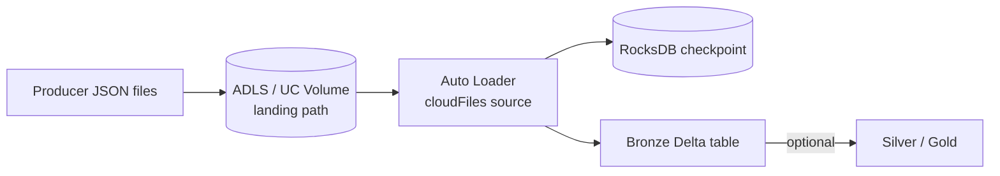

# Tutorial 09 — Auto Loader & Streaming

> Tujuan: ingest file yang terus berdatangan ke ADLS / Volume secara **incremental**, **scalable**, dan **exactly-once**.

> 🏷️ **Cakupan Fitur** _(lihat [Legend](../README.md#-legend-ketersediaan-fitur))_
> - 🔵 **Auto Loader** (`cloudFiles` Structured Streaming source) — Databricks-only ([learn.microsoft.com Auto Loader](https://learn.microsoft.com/azure/databricks/ingestion/cloud-object-storage/auto-loader/))
> - 🔵 **Schema inference & evolution Auto Loader** — Databricks-only
> - 🔵 **File notification mode** (auto-setup event grid/SQS/PubSub) — Databricks-only
> - 🔵 **Lakeflow Spark Declarative Pipelines** (DLT) — Databricks-only
> - 🟢 Pengganti OSS: `spark.readStream.format("parquet/json").load(dir)` — Apache Spark Structured Streaming (skala lebih terbatas)

---

## 🧠 Auto Loader Overview

`Auto Loader` adalah Structured Streaming source bernama **`cloudFiles`** yang:

- Mendiskon file baru di cloud storage (ADLS, S3, GCS, ABFS, UC Volume).
- Track progress di **RocksDB checkpoint** → exactly-once.
- Skala ke **miliaran file**.
- Support schema inference + evolution.
- Lebih murah & cepat dari `spark.readStream.format("json").load(...)`.



---

## 📑 Mode Deteksi File

| Mode | Cara kerja | Cocok untuk |
|------|-----------|------------|
| **Directory listing** | List directory tiap micro-batch. | < 1 jt file, simple. |
| **File notification** | Auto-create EventGrid + StorageQueue. Push notification. | Volume besar, biaya listing mahal. |

Default = directory listing. Untuk production besar → switch ke file notification ([docs](https://learn.microsoft.com/azure/databricks/ingestion/cloud-object-storage/auto-loader/file-notification-mode)).

---

## 🛠️ Demo

Pakai [scripts/09_auto_loader_demo.py](../scripts/09_auto_loader_demo.py).

### Step 1 — Producer mini

Notebook men-generate 5 file JSON ke `Volumes/learn_optimize/tutorial/raw/iot_events`.

### Step 2 — Stream dengan `availableNow`

```python
(spark.readStream
      .format("cloudFiles")
      .option("cloudFiles.format", "json")
      .option("cloudFiles.schemaLocation", SCHEMA_PATH)
      .option("cloudFiles.inferColumnTypes", "true")
      .load(LANDING_PATH)
      .writeStream
      .option("checkpointLocation", CHECKPOINT_PATH)
      .option("mergeSchema", "true")
      .trigger(availableNow=True)
      .toTable(TARGET_TABLE)).awaitTermination()
```

`trigger(availableNow=True)` = proses semua file existing lalu stop. Cocok untuk dijalankan via Job schedule (mis. tiap 5 menit).

### Step 3 — Generate file baru, run lagi

Auto Loader **hanya** membaca file baru (skip yang sudah di-checkpoint). Verifikasi `count(*)` bertambah.

### Step 4 — Tambahkan Liquid Clustering

```sql
ALTER TABLE iot_events_bronze CLUSTER BY (device_id);
OPTIMIZE iot_events_bronze;
```

---

## 🏭 Pola Production: Lakeflow Spark Declarative Pipelines

Cara **paling direkomendasikan** Databricks adalah membungkus Auto Loader di Lakeflow Declarative Pipelines (dulu DLT):

```python
import dlt

@dlt.table
def iot_events_bronze():
    return (spark.readStream.format("cloudFiles")
                  .option("cloudFiles.format", "json")
                  .load("/Volumes/main/iot/raw"))
```

Manfaat:
- Schema location & checkpoint dikelola otomatis.
- Photon + autoscaling otomatis.
- Data quality expectations built-in.
- Lineage di UC.

---

## ⚙️ Tuning Penting

| Option | Default | Saran |
|--------|---------|-------|
| `cloudFiles.maxFilesPerTrigger` | 1000 | Naikkan kalau file kecil & banyak. |
| `cloudFiles.maxBytesPerTrigger` | none | Set 1-10 GB untuk ukuran batch konsisten. |
| `cloudFiles.useNotifications` | false | `true` untuk volume jutaan file. |
| `cloudFiles.includeExistingFiles` | true | `false` kalau hanya ingin proses file baru. |
| `cloudFiles.allowOverwrites` | false | `true` kalau file di-replace, bukan append. |

---

## ⚠️ Hal yang Sering Bikin Pusing

1. **Checkpoint hilang** = re-process semua file. **Backup checkpoint**.
2. **Schema evolution** — set `cloudFiles.schemaEvolutionMode` (default `addNewColumns`).
3. **Out-of-order delete** — pakai soft delete + timestamp comparison ([docs](https://learn.microsoft.com/azure/databricks/ingestion/cloud-object-storage/auto-loader/#handle-out-of-order-data)).

---

## ➡️ Selanjutnya

[Tutorial 10 — Monitoring & Cost Optimization](10-monitoring-cost.md)
