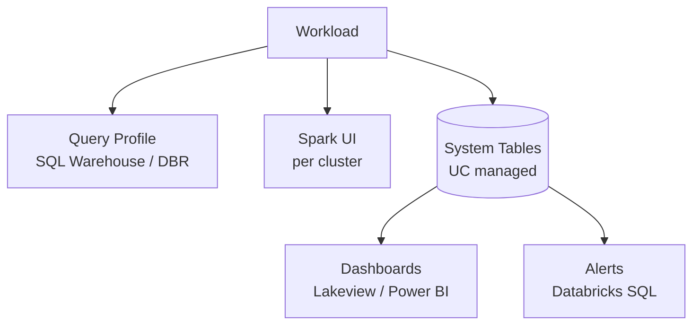
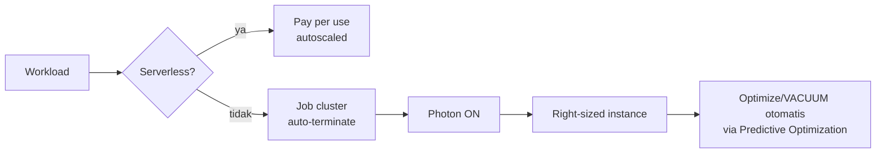
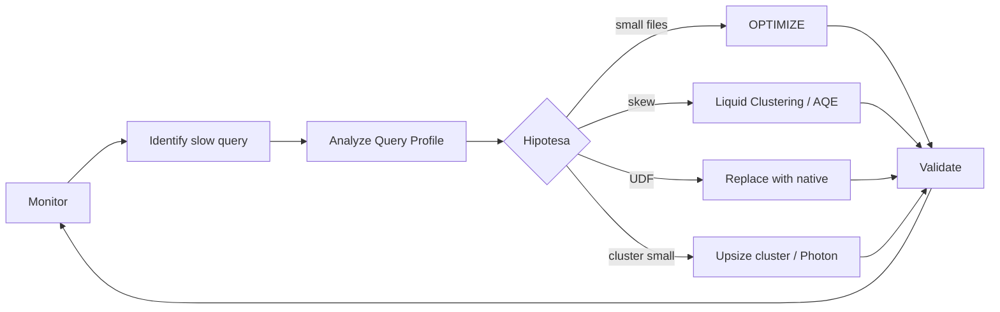

# Tutorial 10 — Monitoring & Cost Optimization

> Tujuan: setelah optimasi, kamu butuh **mengukur** & **memantau** secara berkelanjutan, plus mengontrol biaya.

> 🏷️ **Cakupan Fitur** _(lihat [Legend](../README.md#-legend-ketersediaan-fitur))_
> - 🔵 **System tables** (`system.query.history`, `system.billing.usage`, `system.access.table_lineage`, `system.storage.predictive_optimization_operations_history`) — Databricks/Unity Catalog only
> - 🔵 **Query Profile UI** & **SQL Warehouse Monitoring** — Databricks-only
> - 🔵 **Predictive Optimization** observability — Databricks-only
> - 🔵 **Databricks billing/DBU** — Databricks-only
> - 🟢 Metrik Spark dasar (Spark UI, event logs) — OSS

---

## 📊 Layer Monitoring di Azure Databricks



| Tool | Untuk apa |
|------|-----------|
| **Query Profile** | Diagnosa 1 query: stage, shuffle, files pruned, skew. |
| **Spark UI** | Diagnosa 1 job: SQL DAG, executor, GC. |
| **System Tables** | Trend lintas waktu: cost, usage, slow queries. |
| **Lakeview Dashboards** | Visualisasi system table. |
| **Databricks SQL Alerts** | Notifikasi bila threshold terlewati. |

---

## 🔍 Query Profile (paling sering dipakai)

Buka di SQL Editor → kanan atas hasil query → **View query profile**.

Yang harus diperiksa:
- **Bytes read / Files read** → besar? berarti data skipping kurang.
- **Shuffle write / read** → skewed atau coalesce-able?
- **Time spent** per stage → bottleneck di mana?
- **Spill** → memori kurang, naikkan worker memory atau partition.

---

## 🗂️ System Tables yang Penting

Aktifkan di account console (UC) lalu query:

| System Table | Isi |
|--------------|-----|
| `system.query.history` | Setiap query SQL Warehouse. |
| `system.billing.usage` | DBU consumption per workspace, sku. |
| `system.access.audit` | Siapa akses apa. |
| `system.access.table_lineage` | Tabel paling sering dibaca/ditulis. |
| `system.compute.clusters` | Konfigurasi cluster. |
| `system.storage.predictive_optimization_operations_history` | Apa yang sudah di-optimize otomatis. |

Contoh query siap pakai → [scripts/10_monitoring_queries.sql](../scripts/10_monitoring_queries.sql).

> ℹ️ **Catatan validasi:** kolom `system.query.history` (mis. `compute.warehouse_id`, `produced_rows`, `read_files`, `pruned_files`, `shuffle_read_bytes`, `read_io_cache_percent`) dan `system.access.table_lineage` (`source_table_full_name`, `target_table_full_name`, `created_by`) di script sudah diverifikasi terhadap dokumentasi resmi (April 2026).

---

## 💰 Cost Optimization Checklist



### Top 10 Quick Wins

1. ✅ **Enable Predictive Optimization** di catalog UC.
2. ✅ Pakai **SQL Warehouse Serverless** untuk BI workload.
3. ✅ Pakai **Job cluster** (bukan all-purpose) untuk job terjadwal.
4. ✅ Set **auto-termination** ≤ 30 menit untuk all-purpose.
5. ✅ Aktifkan **Photon** untuk semua SQL/DataFrame.
6. ✅ Pakai **Liquid Clustering** untuk tabel sering di-query.
7. ✅ Hindari **over-partitioning** (cek tabel < 1 TB tanpa partisi).
8. ✅ Gunakan **disk cache** (instance ber-SSD).
9. ✅ Schedule `VACUUM` retention ≥ 7 hari.
10. ✅ Monitor `system.billing.usage` mingguan, set **budget alert** di Azure.

---

## 🚨 Setup Alert (contoh)

Di Databricks SQL → Alerts → New Alert:

```sql
SELECT sum(usage_quantity) AS dbus_today
FROM   system.billing.usage
WHERE  usage_start_time >= current_date();
```

Trigger: `dbus_today > 500` → kirim email / Slack webhook.

---

## 🧪 Workflow Optimasi Berkelanjutan



---

## 🎓 Penutup

Selamat — kamu sudah menyelesaikan **10 tutorial Optimize Azure Databricks**!

### Apa selanjutnya?

- Pelajari [Comprehensive Guide to Optimize Databricks Workloads](https://www.databricks.com/discover/pages/optimize-data-workloads-guide) (Databricks).
- Sertifikasi: **Databricks Certified Data Engineer Associate / Professional**.
- Eksplorasi [Lakeflow Declarative Pipelines](https://learn.microsoft.com/azure/databricks/ldp/) untuk pipeline production.

Selamat meng-optimize! 🚀
